```{r setup, include=FALSE}
knitr::opts_chunk$set(echo = TRUE)
```

# 1. Introduction

The [Shiny application](https://vaproject.shinyapps.io/ISSS608VAProjectShinyApp/) aims to provide various visual exploration tools and techniques for users to understand and analyze the city's demographics, social relationships, neighborhoods and business base.

Below snapshot illustrates the home page of the Shiny application. 


# 2. Modules in Shiny Application

The Shiny application provides 3 main modules to cover different areas of analysis. 

* **Demographics Analysis**: aims to help users to characterize what they can tell about the demographics of the town.

* **Social Activity**: aims to help users to explore the social activities in the community and identify patterns observed in the social networks in the town.

* **Predominant Business**: aims to help users to describe patterns of the neighborhoods and identify the predominant business base of the town.


## 2.1 Demographics Analysis

Under Demographics Analysis, the application provides sub modules for:

* Overall Demographics

* Wage Analysis

* Expenditure Analysis

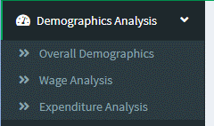


### 2.1.1 Overall Demographics

After selecting "Overall Demographics" from the menu bar, users will see a dashboard providing basic summaries of the demographics in the town. 

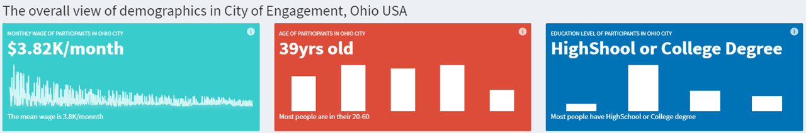

When mouse over the first plot, the monthly wage of each participant in the city will be shown.


The next plot shows the distribution of participants in different age groups. 


The rightmost plot shows the distribution of participants by education level. 


In the next row, 2 plots will be shown namely the percentage of participants with kids in each age group and average monthly wage by education level. 

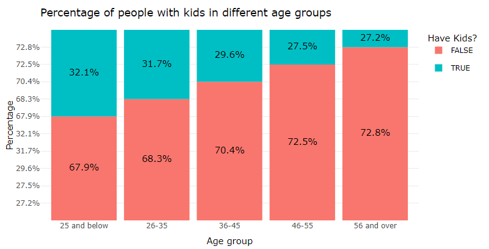


Both plots are generated using **plotly** so users are able to zoom in/out the plot and perform other functions such as download. 

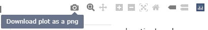

In the next row, first a box violin plot will be shown with pairwise statistical test on participant's joviality by education level. 

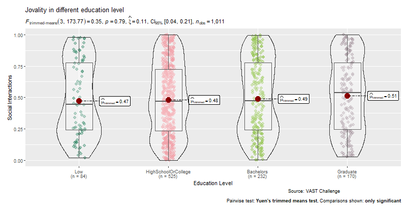

The other plot is the correlogram for the relationship between participant's joviality and wage. 


### 2.1.2 Wage Analysis

* Exploratory Data Analysis (EDA)

After selecting the Wage Analysis from the side menu bar, user will be able to see the Exploratory Data Analysis (EDA) tab with the first box plot for wage distribution in different groups. 

Users can select the option for "Group by" from the dropdown list. 
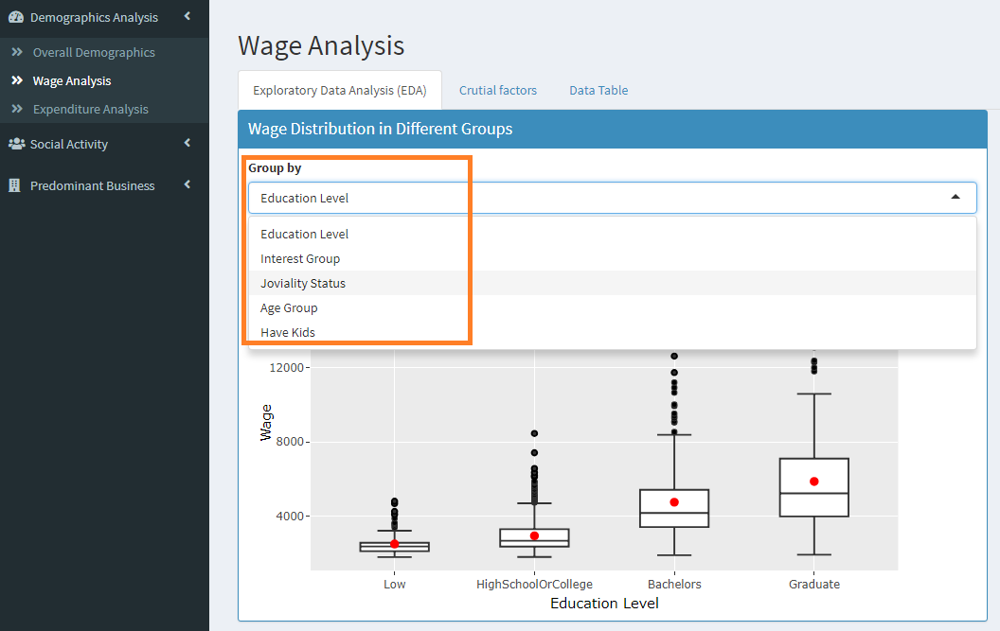

On the right, user can adjust the date range and select factor to view the box violin plot that helps to explore factors that influence residents' wage.
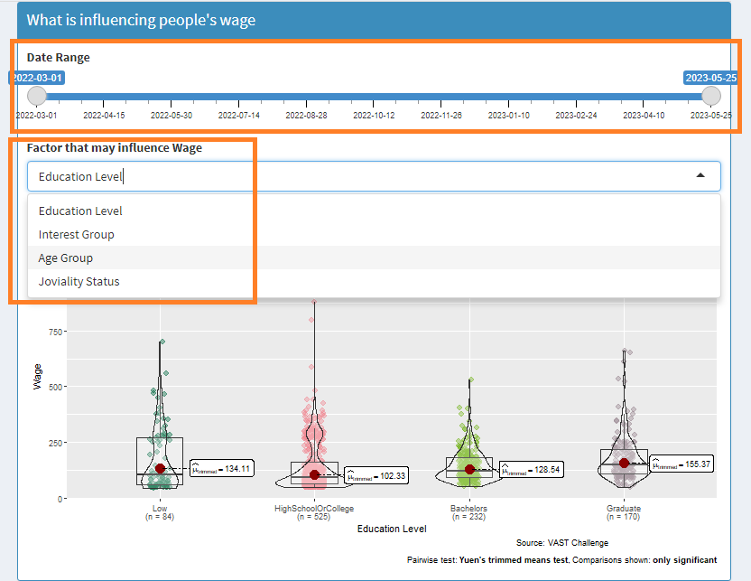

Users can scroll down to view the participants' wage and their average with different selection criteria such as education level, age group and have kids or not. 

More details of the participant will be shown in the tooltip after user mouse over to the individual point in the plot.
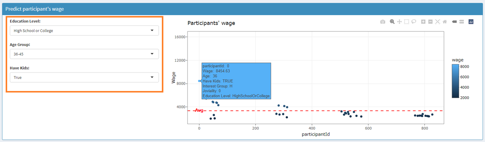


* Crucial Factors

User can switch to the 2nd tab for crucial factors that affect people's wage. 
In this tab, the minimum, maximum and mean of wage will be shown on top, followed by distribution of wage over time period. 
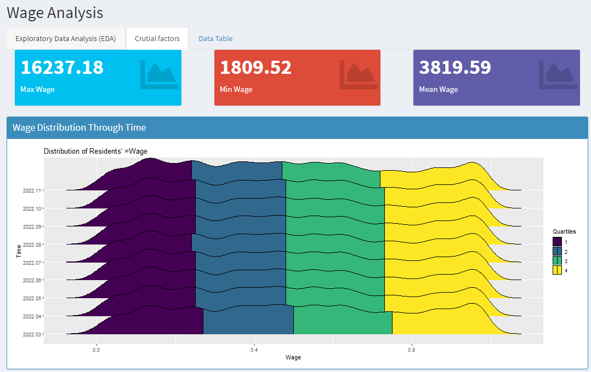

Next, another 4 plots will be shown to illustrate the wage difference by education level, joviality status, age group, and having kids or not.
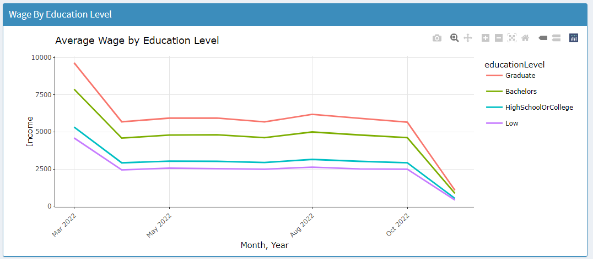


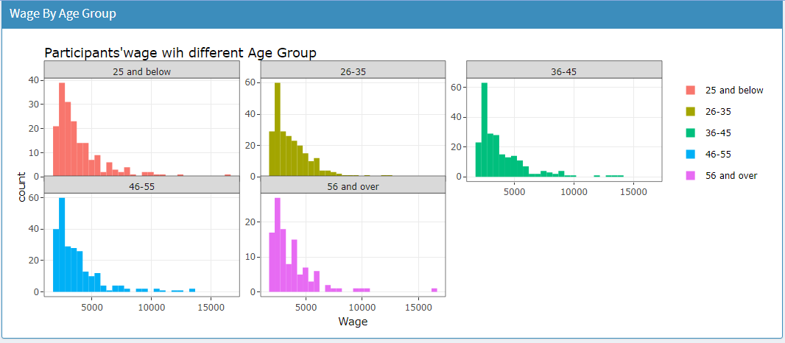

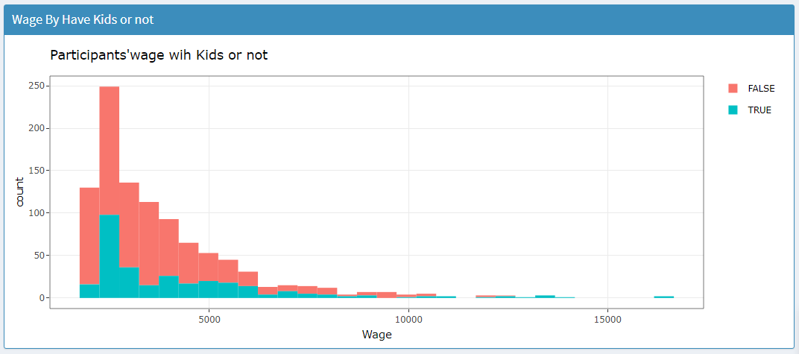


* Data Table

User can switch to the 3rd tab that provides a data table of the residents' data where users can search for any key word in the search field and perform sorting if requried. 


### 2.1.3 Expenditure Analysis

After selecting the Expenditure Analysis from the side menu bar, the heatmap of daily expenses of residents will be shown where users can identify the day of the month or week when residents usually spend more or less.


User can scroll down to use the scatter plot for income and expense analysis and select the data by different groups.
A data table for 4 categories of expenses with the Sparkline charts will be shown in the bottom. 

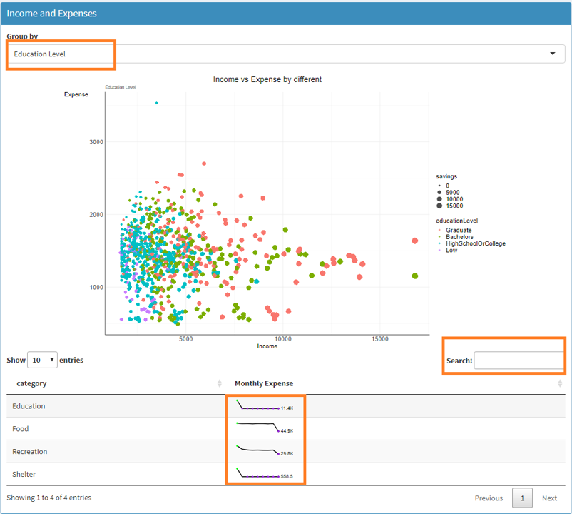


## 2.2 Social Activity

Under Social Activity Analysis, the application provides sub modules for:

* Overall Social Network

* Network by Group

* Network by Individual


### 2.2.1 Overall Social Network

User can select Overall Social Network from the side menu bar and then a social network diagram for all the participants will be shown. 

User can adjust the year and month to see the development of network over time. 


Notes: participants with relatively higher centrality betweenness value are highlighted in red in the diagram.

### 2.2.2 Network by Group

User can go to the Network by Group menu item to explore the social network by education level, interest group or joviality. 
User can also adjust the year and month to view the network changes over time. 


Notes: participants with relatively higher centrality betweenness value are highlighted in red in the diagram.


The social network for the selected group will be shown as facet of individual sub groups. 

### 2.2.3 Network by Individual

To view the network diagram for individual participant, user can switch to the Network by Individual menu item, where user can adjust the period and select participant ID or interest group to view their network diagram. 

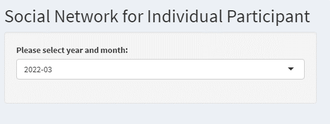

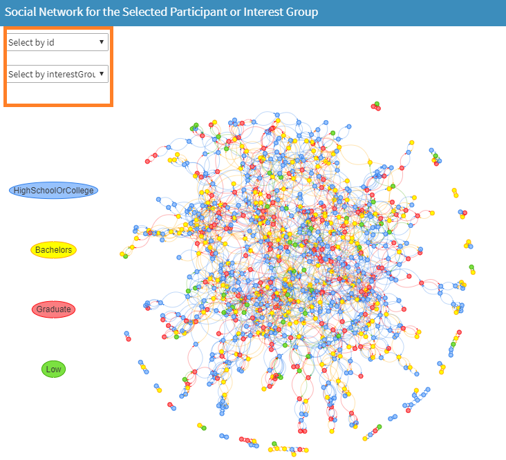

## 2.3 Predominant Business

Under Predominant Business Analysis, the application provides sub modules for:

* Overall Town Map

* Cost Analysis

* Check-in Analysis

* Revenue Analysis

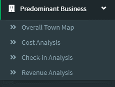


### 2.3.1 Overall Town Map

After user selects Overall Town Map from the side menu bar, a dashboard with summary of the no. of buildings, and venue types including apartments, employers, pubs, restaurants and schools will be shown on top of the page. 


The first plot will show the geographical region of the town divided into central, east, north-west, and south regions.

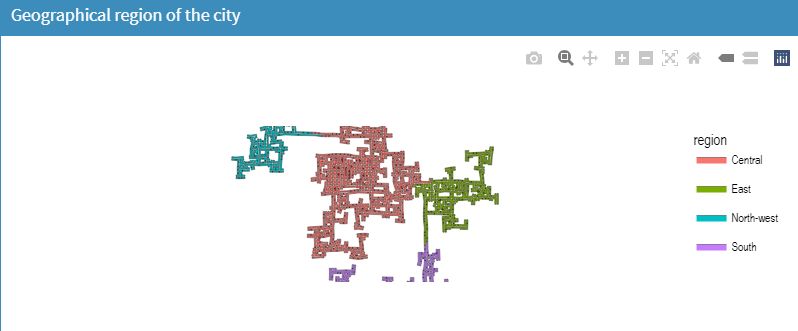

The building types will be shown in the next plot with different colors for commercial, residential or school buildings.


Next, user can select the venue type including apartments, employers, pubs, restaurants and schools to be plotted in the map to view the location and distribution of business in the town. 

User can choose to plot all venue types with different colors or plot only individual venue type. 
Additional details such as geographic region or building type can be selected to add on to the map. 


### 2.3.2 Cost Analysis

User can go to the Cost Analysis from the side menu bar to explore the cost of the business in the town.

First, user can select the venue type. Once done, the map plot on the right will be updated with the selected venue type plotted as points. 


The color/size of the points will be determined based on the cost value such as food cost, rental cost, pub cost, school cost and job rate. 
This helps the user to identify the areas in the city that has higher or lower business cost. 


In this page, user can also select the x, y variables, type of statistical test, plot type to perform a pairwise statistical test to check if there's significant difference of the business cost in different regions. 


User can also key in the plot title and the plot will be updated accordingly. 


### 2.3.3 Check-in Analysis

After user switches to the Check-in Analysis, the no. of daily check-ins will be plotted under the "Plots" tab. 

* Check-in plots

In this tab, user can select restaurant or pub for check-in analysis, and adjust the date range to view the trend changes. 


After mouse over on the plot, more details of the check-in counts will be displayed in the tooltip for the restaurant or pub. With **plotly** graph, user can also choose to view individual restaurant/pub or select multiple ones. 


The restaurants or pubs will also be shown in the map plot with color and size indicating the no. of check-ins. This helps user to identify the region and areas in the city with prosperous business. 


* Correlation test

User can switch to the correlation test tab to perform correlation test on selected variables such as no. of check-ins against pub cost or food cost. 

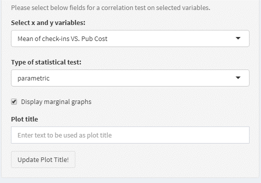

User is allowed to select the type of test, display marginal graph and edit graph title. 

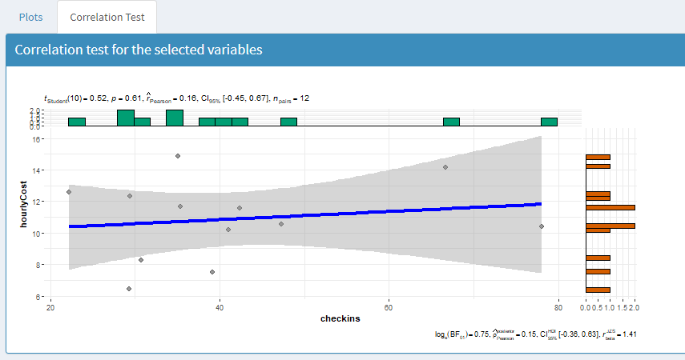


### 2.3.4 Revenue Analysis

User can click Revenue Analysis from the side menu bar to go to the function to check monthly revenue, customers, revenue per customer for restaurants or pubs. 

* Revenue plots
User can select the revenue parameter to be plotted on the graph and adjust the period.  


After mouse over on the plot, user can examine the revenue value for individual restaurant or pub and select individual or multiple restaurants/pubs to shown in the plot if necessary. 


The restaurants or pubs will also be shown in the map plot with color and size indicating the revenue or revenue/customer, which aims to help user to examine the business by region and areas in the city.  

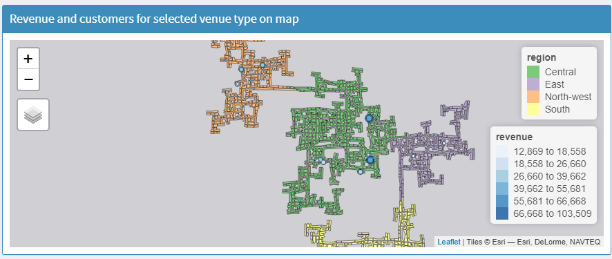

* Statistical test

User can switch to the statistical test tab to select the x, y variables, type of statistical test, plot type to perform a pairwise statistical test to check if there's significant difference of the business revenue in different regions. 


User can edit the plot title if required. 


User can also perform the correlation test on selected variables such as revenue against pub or food cost as well as no. of customers against pub or food cost. 

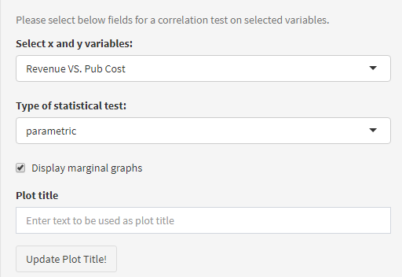

User is allowed to select the type of test, display marginal graph and edit graph title. 

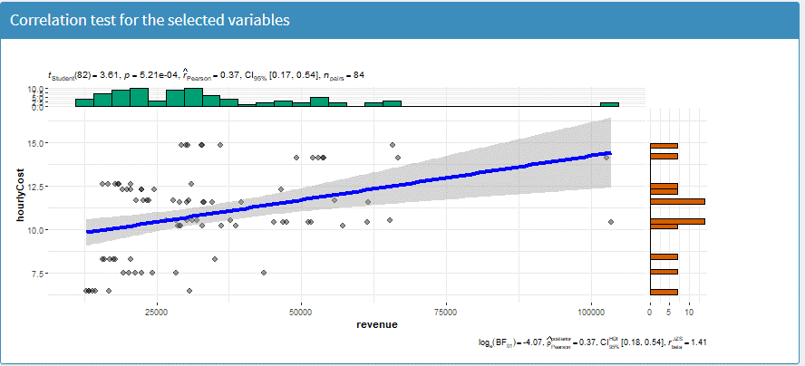


