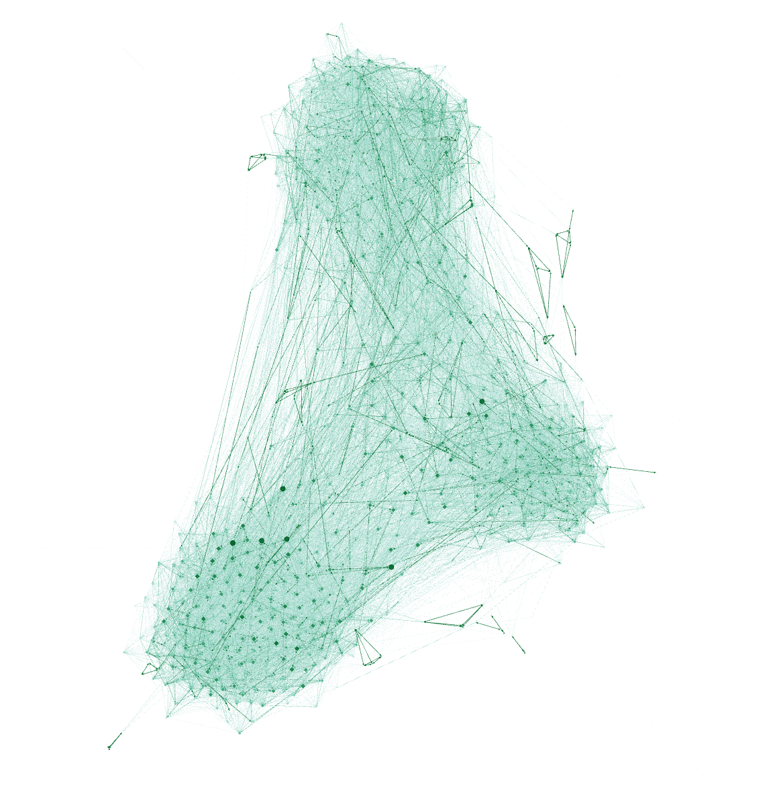
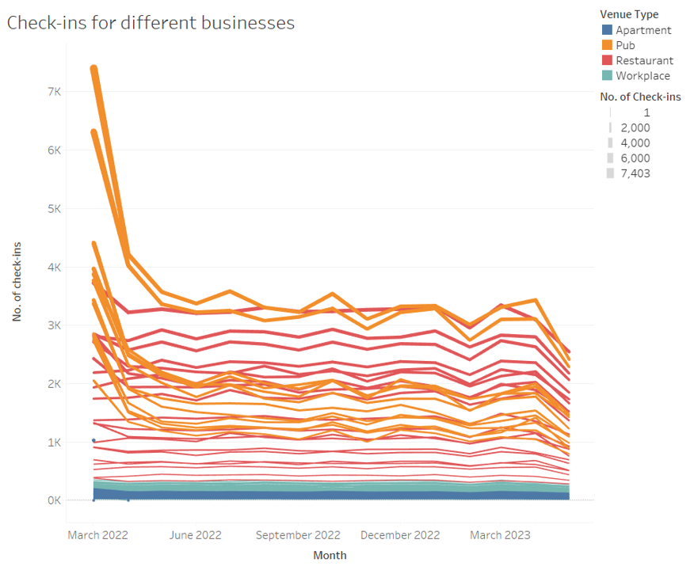
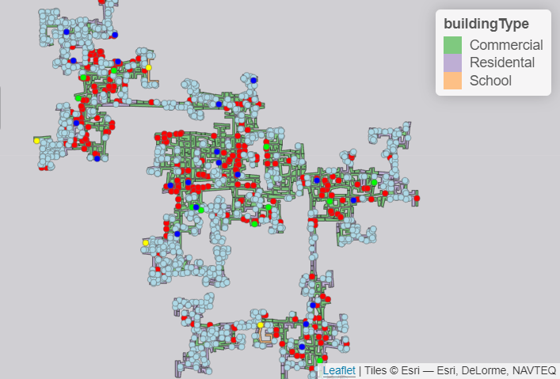
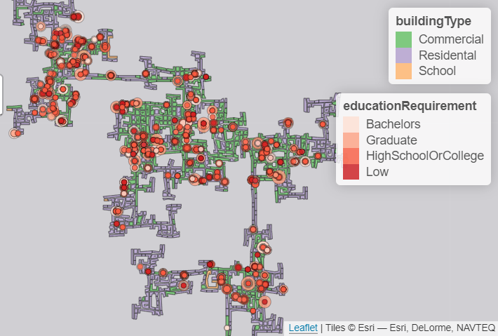
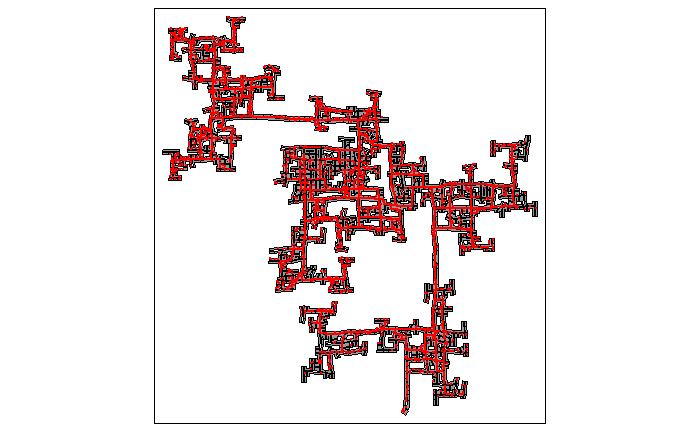

```{r setup, include=FALSE}
knitr::opts_chunk$set(echo = TRUE)
```

# 1. Overview

In this project, our team will try on building web-enabled visual
analytics application by using R Shiny. The project aims to democratize
data and analytics. The application will focus and emphasize on
interactivity and effective integration of techniques from data
analytics and data visualization.

# 2. Project Topic

The topic of Visual Analytics Project will be based on [VAST Challenge
2022](https://vast-challenge.github.io/2022/). Our team will choose
Challenge 1 and build a Shiny Application to answer the questions of the
Challenge. Challenge 1 is to understand the city's demographics and
relationships. We will analyse the available data about the social
networks and other information of the city to learn about the city's
demographics, its neighborhoods, and its business base.

# 3. Motivation

The purpose of the project is to help the city planning team of
Engagement, Ohio USA to understand the current state of the city and
identify opportunities for future growth. The visual analytics exercise
can use related visual analytic techniques to analyse the data collected
from the representative residents using the city's urban planning app.

# 4. Problems and Issues

In this project, we will solve three main problems of Challenge 1.
First, assuming the volunteers are representative of the city's
population, we will characterize the demographics of the town. Also,
considering the social activities in the community, we will describe the
patterns in the social networks in the town. Lastly, we will identify
the predominant business base of the town, and describe patterns we
observe.

# 5. Related Work and Approach

## 5.1 Demographics

Population can be visualized through a variety of charts such as pie
charts, maps, line charts, bar charts and etc, which are all helpful to
visualize population.

For age, we can use a stacked bar plot([Global age-sex-specific
fertility, mortality, healthy life expectancy (HALE), and population
estimates in 204 countries and territories, 1950--2019: a comprehensive
demographic analysis for the Global Burden of Disease Study
2019](https://www.thelancet.com/journals/lancet/article/PIIS0140-6736(20)30977-6/fulltext)),
pie or donut chart to reveal how people's ages are distributed in a
single population group.

For education level, there is a study about [Mapping disparities in
education across low- and middle-income
countries](https://www.nature.com/articles/s41586-019-1872-1) published
on Nature in 2019. They studied the relationship of the change in
average educational attainment rate and income. They use terminal
mapping to visualize it.

## 5.2 Social activities

For the social analysis, we can use the following library packages to
visualize people 's social activities and patterns:

-   visNetwork
-   geomnet
-   [igraph](https://igraph.org/r/)

References:

-   [Social Network Visualization with
    R](https://www.r-bloggers.com/2019/09/social-network-visualization-with-r/)
-   [Visual Social Network Analysis in R and Gephi Part
    II](http://www.designandanalytics.com/visual-social-network-analysis-in-R-and-gephi-part-II)

## 5.3 Predominant business base

For this analysis, we will try visualizing the no. of check-ins or
travels of different locations and venue types by interactive line
charts. We will also try revealing and describing spatial patterns and
relationships on maps using the following R packages:

-   sf
-   tmap
-   raster
-   stars
-   micromap
-   geofacet

For the location data in the dataset, we can learn how to use
[polygon](https://statisticsglobe.com/r-polygon-function-plot/) and
apply to visualize the location of the business bases.

## 5.4 Data journalists and other dataviz professionals

-   Alberto Cairo - University of Miami, Data Visualization
    [Studio](http://albertocairo.com/) and
    [weblog](http://www.thefunctionalart.com/) on visualization,
    infographics and data journalism
-   [David Candless (Information is
    Beautiful)](https://informationisbeautiful.net/)
-   [Guardian datablog](https://www.theguardian.com/data)
-   [John Grimade, Ohio University, School of Visual
    Communication.](http://johngrimwade.com/)
-   [Hans Rosling TED talks](https://www.ted.com/speakers/hans_rosling)
-   [Moritz Stefaner - freelance information
    visualiser](http://well-formed-data.net/)
-   [Edward Tufte (books - The Visual Display of Quantitative
    Information)](https://www.edwardtufte.com/tufte/)
-   [Nathan Yau - flowing data](https://flowingdata.com/)
-   [Stamen Design](https://hi.stamen.com/)
-   [Naomi Robbins -
    Forbes](https://www.forbes.com/sites/naomirobbins/#28c0b6702a6a)

# 6. Storyboards and Prototypes

Below are some initial prototypes/graphs that our group generated using
Tableau and R. Functions will be built on Shiny application for users to
interactively generate similar graphs.


## 6.1 Demograhics

For the discrete values such as age, we can use line plot and use color
to denote the number.

For age group and have kids, we can use pyramid plot.


For interest group, we use


For the relationship of education level and kids, we can use stacked
histgram.


For joviality, we can use violin plot.


The demographics can focus on the interactivity and provide more
flexible choices of inputs variables in the Shiny application to give
users better experience when visualizing demographics of the city.

## 6.2 Social activities

To observe the patterns of the social activities of the city, we use two
different layouts with Gephi to visualize the social network of the
city. The edge weight could be used to indicate the no. of interactions
between 2 parties, e.g. if the 2 residents have more interactions, the
edge weight will be higher.

Another possible technique is to use heatmap to show the no. of
interactions for each resident across the year or total no. of
interactions for all residents across the year.

We can explore more about the social communities with the social
activities and participants attributes using R. For example, we can
detect the communities among the social network and analyse the
demographics of the clusters/groups to identify common characteristics.

We can also try identifying the dominant social influencer in the
community who has the highest no. of interactions with others and the
characteristics of these residents. On the other hand, the inactive
residents with little social interaction could also be identified.

In addition, we can try to visualize the social network dynamics with
the timestamp variable in the social network dataset and see if any
significant changes happen over the period.




## 6.3 Predominant business base

For the area distribution of various types of businesses in the town, we
can explore below scatter plots or generate similar map plots.


For the no. of check-ins at various locations, we can use line charts
and interactively filter based on venue type.
 For example, we can see pub-1344
seems to have highest customer volumes among all pubs.
 Restarurant-1801 seems to have the
highest customer volumes throughout the year among all restaurants.


Besides check-ins, it is also possible to look at Travels data and use
heatmaps to show the most popular locations. We can look at the mapping
from each venue (pub, restaurant, school, employer, and apartment) to
Buildings and identify which building is predominant, i.e. consists of
various types of businesses or consists of more
employers/pubs/restaurants than the other buildings.

 
 
 


